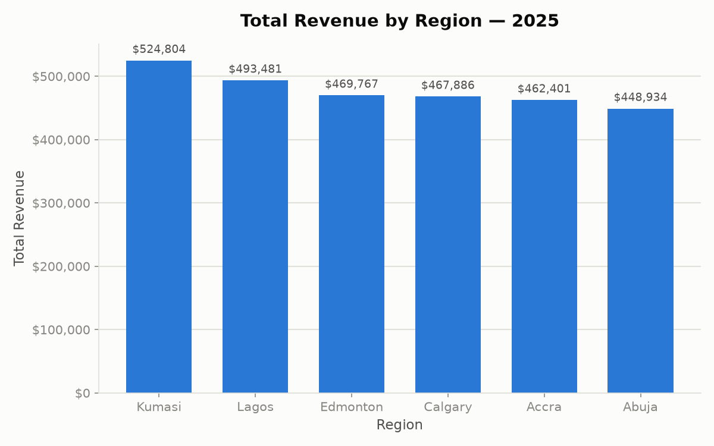
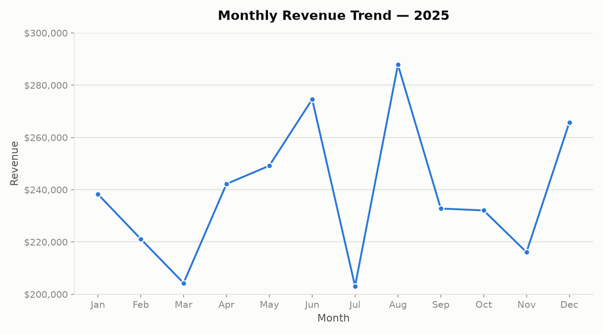
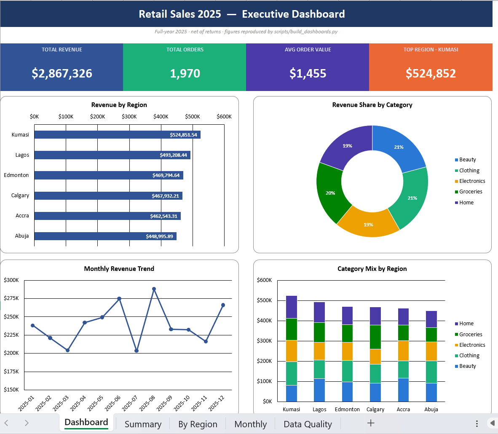

# Retail Sales 2025 — Analysis

End-to-end analysis of a cross-continental retail operation's 2025 order data:
**data quality auditing → cleaning → exploratory analysis → customer
concentration → an interactive dashboard → a formatted Excel management
report**, with business recommendations drawn from each step.

The business spans **six markets on two continents** — four West African cities
(Lagos, Abuja, Accra, Kumasi) and two Canadian (Edmonton, Calgary).

The dataset is also loaded into a **SQLite database** (`retail.db`) for SQL
exploration, and the project ships an **Excel management report**
(`management_report.xlsx`) with an executive dashboard and a full data-quality
audit trail. See [§7](#7-excel-management-report) and [§8](#8-sql-exploration--tooling).

---

## Headline numbers (cleaned data)

| Metric | Value |
|---|---|
| Total revenue | **$2,867,273** |
| Orders (net of returns) | **1,970** |
| Average order value | **$1,455** |
| Unique customers | **396** |
| Avg units / order | **6.0** |

---

## Repository structure

```
retail-sales-2025-analysis/
├── retail_sales_2025.csv / .xlsx   # raw data (source of truth, never modified)
├── retail.db                       # SQLite mirror (gitignored; rebuild via load_sqlite.py)
├── clean/
│   ├── retail_sales_clean.csv      # cleaned dataset — original pipeline (1,970 rows)
│   ├── retail_sales_2025_clean.csv # cleaned dataset — SQL/Excel pipeline (1,970 rows)
│   └── cleaning_audit.csv          # per-step audit trail (feeds the Data Quality sheet)
├── scripts/
│   ├── quality_report.py           # data quality audit
│   ├── clean_data.py               # cleaning pipeline -> clean/retail_sales_clean.csv
│   ├── analysis.py                 # region / monthly / category analysis + PNGs
│   ├── export_dashboard_data.py    # aggregates -> charts/dashboard_data.json
│   ├── customer_concentration.py   # top customers + concentration
│   ├── verify_accra.py             # two-method cross-check example
│   ├── load_sqlite.py              # load the raw CSV into retail.db
│   ├── sql_queries.py              # analytical SQL against retail.db
│   ├── customer_region_check.py    # checks customer_id -> region uniqueness
│   ├── clean_retail_sales.py       # cleaning + audit trail -> clean/ (SQL/Excel pipeline)
│   ├── build_management_report.py  # Summary / By Region / Monthly sheets
│   └── build_dashboards.py         # rebuilds the workbook + Dashboard & Data Quality sheets
├── charts/
│   ├── revenue_by_region.png
│   ├── monthly_revenue_trend.png
│   ├── retail_sales_dashboard2.png # screenshot of the Excel executive dashboard
│   └── dashboard_data.json
├── dashboard.html                  # interactive HTML dashboard (open in a browser)
├── management_report.xlsx          # Excel report: Dashboard + detail + Data Quality
├── .mcp.json                       # MCP servers: sqlite, excel, powerbi
├── .claude/agents/data-engineer.md # project data-engineer agent
├── CLAUDE.md                       # working rules for this project
└── README.md
```

### Reproduce everything
```bash
# Original analysis pipeline (pandas + matplotlib + HTML dashboard)
python scripts/quality_report.py          # 1. audit the raw data
python scripts/clean_data.py              # 2. write clean/retail_sales_clean.csv
python scripts/analysis.py                # 3. tables + charts/*.png
python scripts/export_dashboard_data.py   # 4. dashboard data
python scripts/customer_concentration.py  # 5. customer analysis

# SQL + Excel pipeline
python scripts/load_sqlite.py             # 6. load raw CSV -> retail.db
python scripts/sql_queries.py             # 7. analytical SQL against retail.db
python scripts/clean_retail_sales.py      # 8. clean + emit clean/cleaning_audit.csv
python scripts/build_dashboards.py        # 9. build management_report.xlsx (all sheets)
```
Requires Python 3 with `pandas`, `matplotlib`, and `openpyxl`. Close
`management_report.xlsx` in Excel before rerunning step 9 (an open file locks it).

---

## 1. Data quality audit

The raw file held **2,025 rows** with several issues (full script: `scripts/quality_report.py`):

| Issue | Rows affected | Treatment |
|---|---|---|
| Missing `unit_price` & `revenue` | 61 | Imputed price at **category median**, recomputed revenue |
| Fully duplicated rows | 25 | Dropped |
| Negative quantity (returns/refunds) | 30 | Removed |
| Dirty region label `' calgary '` | subset of Calgary | Trimmed + title-cased → merged into `Calgary` |

**Result:** a clean dataset of **1,970 rows** with zero missing values and
internally consistent revenue (`quantity × unit_price`).

> **Why median, not mean, for missing prices?** Unit prices are skewed — a few
> high-priced items pull the mean upward. The median reflects the *typical* price
> for a category and is robust to those outliers, making it the safer imputation.

---

## 2. Revenue by region



| Region | Revenue | Share |
|---|---|---|
| Kumasi | $524,804 | 18.3% |
| Lagos | $493,481 | 17.2% |
| Edmonton | $469,767 | 16.4% |
| Calgary | $467,886 | 16.3% |
| Accra | $462,401 | 16.1% |
| Abuja | $448,934 | 15.7% |

**Revenue is remarkably even across all six markets** — only a **~17% gap**
($76K) separates the top and bottom region.

---

## 3. Monthly revenue trend



Monthly revenue swings between a **July low (~$203K)** and an **August peak
(~$288K)** — a **~40% swing in 30 days**, the sharpest movement of the year.
March is a secondary soft point; December closes strong (~$266K).

*(The y-axis is deliberately zoomed to $200K–$300K so month-to-month movement is
legible; keep the non-zero baseline in mind when sharing.)*

---

## 4. Category performance

Company-wide, the five categories are **tightly bunched** — no category dominates:

| Category | Revenue |
|---|---|
| Clothing | $601,484 |
| Beauty | $597,638 |
| Home | $558,749 |
| Groceries | $558,241 |
| Electronics | $551,161 |

### Top category per region — a cultural split

| Region | Top category | Revenue |
|---|---|---|
| Calgary | **Groceries** | $118,944 |
| Accra | **Beauty** | $117,951 |
| Kumasi | **Clothing** | $116,651 |
| Lagos | **Beauty** | $115,378 |
| Abuja | **Clothing** | $110,623 |
| Edmonton | **Clothing** | $105,141 |

The African cities lead with **Beauty / Clothing**; **Calgary is the only market
where Groceries wins** — a clear signal that demand mix differs by geography.

---

## 5. Customer concentration

Is revenue dependent on a few big buyers? (script: `scripts/customer_concentration.py`)

| Segment | Share of revenue |
|---|---|
| Top 10 customers | 7.3% |
| Top 10% (40 customers) | **22.8%** |
| Top 20% (79 customers) | 38.8% |
| Top 50% (198 customers) | 73.0% |

**Mildly concentrated, not extreme.** The top decile earns ~2.3× its "fair
share" (22.8% vs. a flat 10%), but no single customer exceeds **0.81%** of total
revenue. This is a **broad-based** business — low dependency risk, but also no
natural VIP whale tier.

---

## 6. Interactive dashboard

`dashboard.html` is a self-contained, responsive dashboard (light/dark themes,
hover tooltips) covering KPIs, the monthly trend, region and category
breakdowns, and a **region × category heatmap** that visualizes the cultural
split above. Open it in any browser — no server or dependencies required.

---

## 7. Excel management report

`management_report.xlsx` is a formatted, five-sheet workbook built with
`openpyxl` (`scripts/build_dashboards.py`). It opens on an **executive
dashboard**:



| Sheet | Contents |
|---|---|
| **Dashboard** | KPI cards + four charts: revenue by region, category share, monthly trend, category mix by region |
| **Summary** | Total revenue, order count, average order value |
| **By Region** | Region × category revenue pivot with totals; top region highlighted |
| **Monthly** | Monthly revenue with an embedded line chart |
| **Data Quality** | Full cleaning audit trail (below) |

Chart colors use the validated colorblind-safe categorical palette; the workbook
is rebuilt from the cleaned data on every run so the charts never drift.

### Data Quality sheet — an auditable trail

Every cleaning action and the rows it affected are recorded so an auditor can
trace `raw → clean`. The counts come straight from the cleaning run
(`scripts/clean_retail_sales.py` → `clean/cleaning_audit.csv`), so the sheet
cannot drift from what actually executed:

| Step | Action | Rows in | Affected | Rows out |
|---|---|---|---|---|
| 1 | Load raw dataset | — | — | 2,025 |
| 2 | Remove duplicate orders | 2,025 | 25 | 2,000 |
| 3 | Standardize region labels | 2,000 | 40 | 2,000 |
| 4 | Remove return rows | 2,000 | 30 | 1,970 |
| 5 | Impute missing unit prices | 1,970 | 59 | 1,970 |
| 6 | Recalculate revenue | 1,970 | 59 | 1,970 |
| 7 | Final validated dataset | 1,970 | — | 1,970 |

**Reconciliation:** 2,025 raw − 25 duplicates − 30 returns = **1,970 clean rows**.

> **Note on the two clean files.** This SQL/Excel pipeline
> (`clean_retail_sales.py`) imputes missing prices at the **global** median
> ($244.71) and reports counts in true execution order — dedupe runs first, so
> region fixes show **40** (not 41) and imputations **59** (not 61). The original
> `clean_data.py` uses a **category** median. Both yield 1,970 rows; totals differ
> by ~$50 out of $2.87M — immaterial, but documented for traceability.

---

## 8. SQL exploration & tooling

The cleaned data is mirrored into **`retail.db`** (SQLite) for ad-hoc SQL.
`scripts/sql_queries.py` holds the analytical queries; for example, **top 5
regions by average order value** (summed per order, then averaged):

| Region | Avg order value |
|---|---|
| Kumasi | $1,552.67 |
| Abuja | $1,491.48 |
| Edmonton | $1,472.62 |
| Accra | $1,440.50 |
| Lagos | $1,426.25 |

**MCP servers** (`.mcp.json`) wire three tools into the workflow: `sqlite`
(query `retail.db`), `excel` (read/write workbooks), and `powerbi` (Power BI
semantic-model work). A project **data-engineer agent**
(`.claude/agents/data-engineer.md`) encodes the working rules and this dataset's
quirks (returns, the `' calgary'` fix, order-level grain).

---

## Key insights

1. **No region carries the business.** Revenue is spread within a 17% band across
   six markets. There's no single star market to lean on — and equally, no
   single point of failure.
2. **Demand mix is cultural, not uniform.** Every region leads with Beauty or
   Clothing *except Calgary* (Groceries). A one-size-fits-all merchandising plan
   leaves money on the table.
3. **Sharp mid-year volatility.** A July trough immediately followed by an August
   peak (~40% swing) is the most significant seasonal signal in the year.
4. **Broad, resilient customer base.** Losing even the #1 customer costs <1% of
   revenue, but there's no high-value segment currently being cultivated.
5. **Categories are balanced.** A ~$50K spread across all five categories means
   the catalogue is well-diversified with no dead weight — and no runaway winner.

---

## Business improvement recommendations

**Merchandising — localize the assortment.**
Stock and promote to each market's demonstrated preference: Beauty in
Accra/Lagos, Clothing across Abuja/Kumasi/Edmonton, Groceries in Calgary.
Region-specific promotions should beat the current uniform approach.

**Investigate & smooth the July dip.**
Confirm whether July's trough is genuine seasonality or an operational artifact
(stockouts, promo-calendar gaps, supply issues). Then plan inventory and staffing
around the reliable **August spike** so the business captures — rather than
scrambles for — that demand.

**Grow the mid-tier, don't chase whales.**
With no dominant customers, the biggest upside is **moving the broad middle**
(the 40–70th percentile) up a tier via loyalty incentives and reorder nudges,
rather than a VIP program that only a thin top would qualify for.

**Lift the whole regional base.**
Because markets are so evenly matched, a proven tactic in one city is likely to
transfer to the others. Pilot growth experiments in one region, measure, and
**roll the winners out network-wide.**

**Protect margin on returns.**
30 return/refund rows were removed for this revenue analysis, but returns are a
real cost. Track return **rate by category and region** separately to catch
quality or sizing problems early (Clothing is a common culprit).

**Institutionalize data quality.**
The raw feed carried duplicates, missing prices, and inconsistent labels
(`' calgary '`). Add validation at ingestion — unique `order_id`, non-null
price, controlled region vocabulary — so reports stay trustworthy without manual
cleaning each cycle.

---

## Notes on method

- Raw data is treated as **read-only**; all cleaned output goes to `clean/`.
- Every reported figure is produced by a **rerunnable script** in `scripts/` for
  independent verification (e.g. `verify_accra.py` cross-checks a figure two ways).
- Category colors in the charts and dashboard are validated colorblind-safe.
- The Excel report's numbers are **audit-traceable**: the Data Quality sheet is
  generated from the same cleaning run that produces the data, not typed by hand.
- `retail.db` is **generated** (gitignored); rebuild it with
  `python scripts/load_sqlite.py`. Local Claude settings
  (`.claude/settings.local.json`) are also gitignored; shared project config
  (`.mcp.json`, `.claude/agents/`) is tracked.
